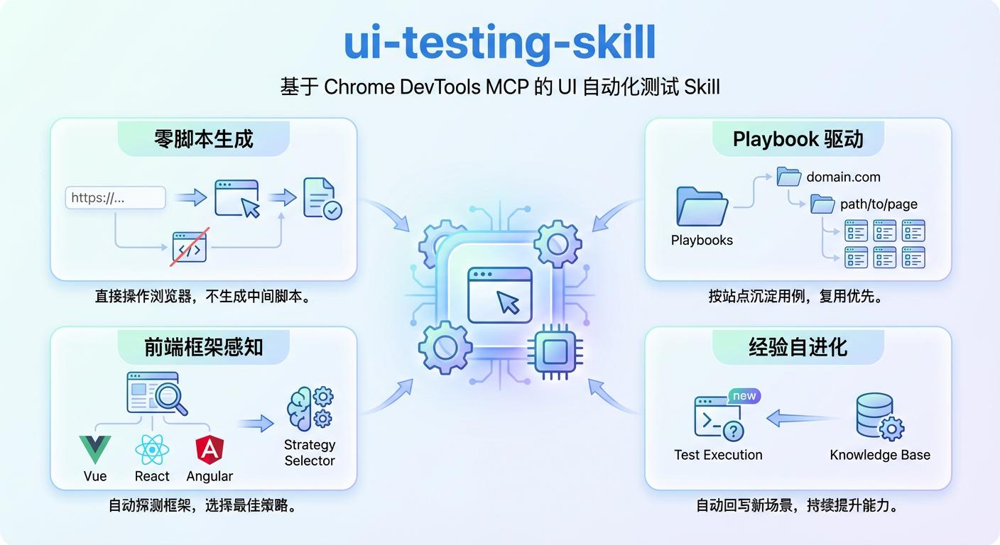

# ui-testing-skill ——— 基于 Chrome DevTools MCP 的 UI 自动化测试 Skill



UI Testing Skill 是基于 Chrome DevTools MCP 构建的 UI 自动化测试 Skill，无需编写测试脚本，仅需输入 URL 即可自动完成页面遍历、E2E 用例梳理、测试执行与标准化报告输出。核心依托 MCP 直连浏览器会话，复用本地已登录 Chrome 环境，通过 Playbook 沉淀用例并实现经验自进化，让 UI 自动化测试零脚本、高复用、易扩展。

## 特性

* **零脚本生成** — 通过 MCP 工具直接操作浏览器，不生成任何中间测试脚本
* **Playbook 驱动** — 按站点/路径自动沉淀用例，复用优先，避免重复劳动
* **前端框架感知** — 内置 Vue2/Vue3/React/Angular 探测，自动选择最佳交互策略
* **经验自进化** — 遇到新框架、新场景时自动将解决方案回写到通用脚本和策略层

## 前置条件

| 依赖 | 版本要求 |
| --- | --- |
| Node.js | MCP 模式 >= 20.19；CDP Proxy 模式 >= 22 |
| Google Chrome | 本机已安装 |
| chrome-devtools-mcp | 通过 npx 自动拉取 |

## 安装

默认使用 **Agent 自然语言自动安装**（推荐）。你只需要把下面这段话发给 Agent，让它自己完成下载、放置和接入：

```text
请帮我安装 ui-testing-skill：
1) 从 https://github.com/bodhiye/ui-testing-skill 获取最新代码（clone 或下载均可）
2) 将整个 ui-testing-skill 目录放到你的 skills 目录下（路径按你的 Agent 约定处理，不要硬编码）
3) 确认你能读取到 ui-testing-skill/SKILL.md 和 ui-testing-skill/scripts/*
4) 如需浏览器自动化能力：按 README 的“快速开始”启动 Chrome，并将 chrome-devtools-mcp 注册为 MCP Server
完成后告诉我：Skill 放置路径、MCP 配置位置、以及如何在对话里触发测试
```

说明：

* 本项目不依赖 `npm install`。`chrome-devtools-mcp` 运行时通过 `npx` 自动拉取；CDP Proxy 使用 Node.js 内置能力。
* 若 Agent 不支持自动放置 skill 文件，才需要人工把目录放入 Agent 的 skills 目录（具体路径以 Agent 文档为准）。

## 快速开始

### 1. 启动 Chrome

```bash
node ./scripts/chrome-devtools-mcp.mjs
```

脚本会自动：

1. 检测空闲端口（默认 9222）
2. 优先复用已运行的 Chrome DevTools 端口，否则启动带远程调试端口的 Chrome
3. 等待 Chrome 就绪并输出端口与可复制的 MCP 配置片段

也可通过环境变量控制：

```bash
PORT=9222 node ./scripts/chrome-devtools-mcp.mjs
```

### 2. 配置 MCP Server

确保 Agent 的 MCP 配置中包含 `chrome-devtools` ：

```json
{
  "mcpServers": {
    "chrome-devtools": {
      "command": "npx",
      "args": ["-y", "chrome-devtools-mcp@latest", "--browser-url=http://127.0.0.1:${PORT}"]
    }
  }
}
```

将上述配置中的 `${PORT}` 替换为 `chrome-devtools-mcp.mjs` 脚本输出的端口。

### 3. 验证连接

```bash
curl -sS "http://127.0.0.1:${PORT}/json/version"
```

在 Agent 中确认 `chrome-devtools` MCP 显示为已连接状态。

### 4. 执行测试

在 Agent 中对话：

```text
用 ui-testing-skill 测试 https://example.com
```

## 项目结构

```text
ui-testing-skill/
├── SKILL.md                          # Skill 核心定义（Agent 读取此文件驱动所有行为）
├── skill.json                        # Skill 元数据
├── README.md                         # 本文件
├── scripts/
│   ├── chrome-devtools-mcp.mjs       # Chrome DevTools 端口启动/复用 + 输出 MCP 配置片段
│   └── detect.mjs                    # 页面探测工具集（ES Module）
└── playbooks/
    └── {domain}/
        ├── {domain}.md               # 站点 Playbook（用例 + 技术特征）
        └── {YYYYMMDDHHmm}/
            ├── report.md             # 测试报告
            ├── results.json          # 结构化测试结果（可选但推荐）
            └── *.png                 # 测试截图
```

## Skill 工作流概览

```text
URL 输入
  │
  ▼
校验 URL → 解析 Playbook 路径 → 是否已有 Playbook？
  │                                  │          │
  │                                  有         无
  │                                  │          │
  │                                  ▼          ▼
  │                              复用用例    BFS 遍历 → 梳理用例 → 写入 Playbook
  │                                  │          │
  │                                  └────┬─────┘
  │                                       ▼
  │                              按优先级执行用例
  │                                       │
  │                                       ▼
  │                              生成测试报告
  │                                       │
  │                                       ▼
  └──────────────────────────── 经验进化回写（§13）
```

## 经验进化机制

Skill 在反复使用中自动积累能力，不只是完成当次测试：

| 层级 | 触发条件 | 回写目标 |
| --- | --- | --- |
| Playbook | 每次测试必执行 | 站点 Playbook「站点技术特征」章节 |
| 通用脚本 | `detectFramework` 返回 unknown 但手动识别出框架 | `scripts/detect.mjs` 的 `[EXTEND]` 标记处 |
| 策略 | 遇到未覆盖场景且找到方案 | `SKILL.md` §8.4+ 新子章节 |
| 跨站复用 | 新站点框架与已测站点相同 | 直接读取已有 Playbook |

详见 [SKILL.md §13](SKILL.md#13-经验进化) 经验进化章节。

## scripts/detect.mjs

统一的页面探测工具集，ES Module 格式。Agent 读取后将函数体注入 `evaluate_script` 执行。

| 导出函数 | 用途 |
| --- | --- |
| `detectFramework` | 识别 SPA 框架（Vue2/Vue3/React/Angular/jQuery） |
| `detectFormElements` | 收集所有表单元素的类型、选择器、当前值、可选项 |
| `findVue2FormComponent` | Vue 2：递归查找持有表单数据的组件路径及方法 |

扩展方式：在文件中搜索 `[EXTEND: new framework]` 和 `[EXTEND: new finder]` 标记。

## 常用命令

| 用户指令 | 说明 |
| --- | --- |
| `测试 https://example.com` | 执行完整测试流程 |
| `测试 https://example.com，更新用例` | 重新遍历并覆盖 Playbook |
| `查询 example.com 的 Playbook` | 查看已有用例列表 |
| `查询本次测试的报错明细` | 查看报错分类与详情 |
| `导出本次测试报告` | 获取报告文件路径 |
| `删除 example_com_001 用例` | 删除指定用例 |

## 接入新 Agent 的最佳实践

### 步骤一：安装 Skill 文件

将整个 `ui-testing-skill/` 目录放到 Agent 能读取的 Skills 目录下。不同 Agent 的约定路径不同：

* **OpenClaw**：通常放在 `~/.openclaw/skills/ui-testing-skill/`
* **Trae**：通常放在 `~/.trae/skills/ui-testing-skill/`
* **Claude Code**：通常放在 `~/.claude/skills/ui-testing-skill/`
* **Cursor**：通常放在 `~/.cursor/skills/ui-testing-skill/`

核心要求：Agent 能读取到 `SKILL.md` 和 `scripts/` 目录下的文件。

### 步骤二：注册 MCP Server

运行 `node scripts/chrome-devtools-mcp.mjs` 启动或复用 Chrome DevTools 端口；然后将脚本输出的 `mcpServers.chrome-devtools` 配置片段添加到 Agent 的 MCP 配置文件中，并确保其中的端口号与脚本实际输出一致；若 Agent 需要重载配置，按其官方文档执行重启或重新加载。

### 步骤三：验证 MCP 工具可用

在 Agent 中调用 `list_pages` ，确认能返回当前 Chrome 标签页列表。

### 步骤四：首次测试

给一个简单的站点试跑一次：

```text
用 ui-testing-skill 测试 https://your-target-site.com
```

首次测试会自动：

1. 探测框架类型
2. 收集表单元素信息
3. 梳理 E2E 用例并写入 Playbook
4. 执行用例并生成报告
5. 将站点技术特征沉淀到 Playbook

后续再测同一站点时，直接复用 Playbook，速度更快。

### 注意事项

* Chrome 必须以 `--remote-debugging-port` 参数启动，否则 MCP 无法连接
* 首次配置 MCP 后需要**重启 Agent** 使配置生效
* Skill 通过 MCP 工具直接操作浏览器，**不会**生成任何 Python/Node.js 测试脚本
* 截图默认使用 `fullPage=true`，确保捕获完整页面内容
* 测试过程中遇到的登录页，需要用户提供测试账号；Skill 不会持久化存储凭据
* 若在 `CDP Proxy` 模式下不得不临时生成辅助执行脚本（如 `run_test.mjs`），Agent 必须在测试结束后自动删除，不应要求用户手工清理

## License

MIT. See `LICENSE` .

## Star History

[](https://www.star-history.com/?repos=bodhiye%2Fui-testing-skill\&type=date\&legend=top-left)
