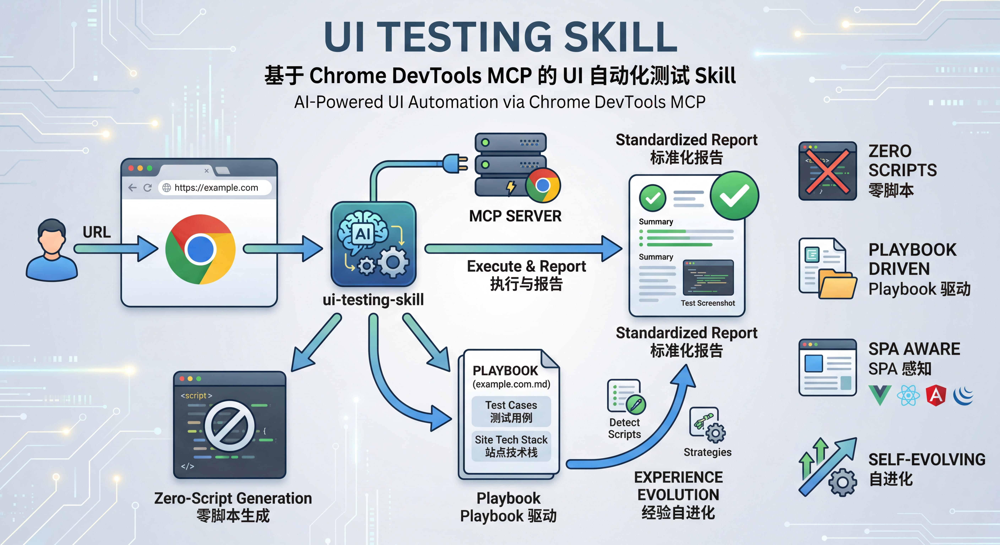

# ui-testing ——— 基于 Chrome DevTools MCP 的 UI 自动化测试 Skill



UI Testing 是基于 Chrome DevTools MCP 构建的 UI 自动化测试 Skill，无需编写测试脚本，仅需输入 URL 即可自动完成页面遍历、E2E 用例梳理、测试执行与标准化报告输出。核心依托 MCP 直连浏览器会话，复用本地已登录 Chrome 环境，通过 Playbook 沉淀用例并实现经验自进化，让 UI 自动化测试零脚本、高复用、易扩展。

## 特性

* **零脚本生成** — 通过 MCP 工具直接操作浏览器，不生成任何中间测试脚本
* **Playbook 驱动** — 按站点/路径自动沉淀用例，复用优先，避免重复劳动
* **前端框架感知** — 内置 Vue2/Vue3/React/Angular 探测，自动选择最佳交互策略
* **组件库感知** — 自动识别 Arco Design / Ant Design / Element UI 等 8 种组件库，匹配最佳交互方案
* **页面模式识别** — 自动识别 CRUD 列表、向导表单、Dashboard 等 10 种页面模式
* **经验自进化** — 9 层进化架构：从失败模式挖掘、组件库知识沉淀到置信度生命周期管理

## 前置条件

| 依赖 | 版本要求 |
| --- | --- |
| Node.js | MCP 模式 >= 20.19；CDP Proxy 模式 >= 22 |
| Google Chrome | 本机已安装 |
| chrome-devtools-mcp | 通过 npx 自动拉取 |

## 安装

默认使用 **Agent 自然语言自动安装**（推荐）。你只需要把下面这段话发给 Agent，让它自己完成下载、放置和接入：

```text
请帮我安装 ui-testing：
1) 从 https://github.com/bodhiye/ui-testing 获取最新代码，将整个 ui-testing 目录放到你的 skills 目录下
2) 运行 node scripts/chrome-devtools-mcp.mjs 启动 Chrome DevTools 端口
3) 将脚本输出的 mcpServers.chrome-devtools 配置片段注册到你的 MCP 配置中，确保端口号与脚本输出一致；若需重载配置则自行重启
4) 调用 list_pages 验证 MCP 工具可用，确认能返回 Chrome 标签页列表
完成后告诉我：Skill 放置路径、MCP 配置位置、验证结果
```

说明：

* 本项目不依赖 `npm install`。`chrome-devtools-mcp` 运行时通过 `npx` 自动拉取；CDP Proxy 使用 Node.js 内置能力。
* 若 Agent 不支持自动放置 skill 文件，才需要人工把目录放入 Agent 的 skills 目录（具体路径以 Agent 文档为准）。

## 项目结构

```text
ui-testing/
├── SKILL.md                          # Skill 核心定义（Agent 读取此文件驱动所有行为）
├── skill.json                        # Skill 元数据
├── README.md                         # 本文件
├── scripts/
│   ├── chrome-devtools-mcp.mjs       # Chrome DevTools 端口启动/复用 + 输出 MCP 配置片段
│   └── detect.mjs                    # 页面探测工具集（ES Module）
├── knowledge/
│   ├── component-lib.md              # UI 组件库交互知识库（跨站点复用）
│   └── evolution-log.md              # 进化日志（变更追踪与自检）
└── playbooks/
    └── {domain}/
        ├── {domain}.md               # 站点 Playbook（用例 + 技术特征）
        └── {YYYYMMDDHHmm}/
            ├── report.md             # 测试报告
            ├── results.json          # 结构化测试结果（可选但推荐）
            └── *.png                 # 测试截图
```

## Skill 工作流概览

```text
URL 输入
  │
  ▼
校验 URL → 解析 Playbook 路径 → 是否已有 Playbook？
  │                                  │          │
  │                                  有         无
  │                                  │          │
  │                                  ▼          ▼
  │                              复用用例    BFS 遍历 → 梳理用例 → 写入 Playbook
  │                                  │          │
  │                                  └────┬─────┘
  │                                       ▼
  │                              按优先级执行用例
  │                                       │
  │                                       ▼
  │                              生成测试报告
  │                                       │
  │                                       ▼
  └──────────────────────────── 经验进化回写（§13）
```

## 经验进化机制

Skill 在反复使用中自动积累能力，不只是完成当次测试。9 层进化架构：

| 层级 | 触发条件 | 回写目标 |
| --- | --- | --- |
| Playbook | 每次测试必执行 | 站点 Playbook「站点技术特征」章节 |
| 通用脚本 | detectFramework/ComponentLib/Pattern 返回 unknown | `scripts/detect.mjs` 的 `[EXTEND]` 标记处 |
| 策略 | 遇到未覆盖场景且找到方案 | `SKILL.md` §8.x 新子章节 |
| 跨站复用 | 新站点与已测站点技术栈有交集 | 读取已有 Playbook + 组件库知识 |
| **组件库知识** | 遇到新交互问题或发现可泛化模式 | `knowledge/component-lib.md` |
| **失败模式挖掘** | 有失败用例时必执行 | Playbook「已知问题与恢复方案」+ 组件库知识 |
| **置信度管理** | 每次测试后 | 知识条目的置信度升降级与废弃 |
| **历史趋势** | 每次测试后 | Playbook「测试历史」+ 回归/Flaky 检测 |
| **进化日志** | 每次进化变更 | `knowledge/evolution-log.md` |

详见 [SKILL.md §13](SKILL.md#13-经验进化) 经验进化章节。

## scripts/detect.mjs

统一的页面探测工具集，ES Module 格式。Agent 读取后将函数体注入 `evaluate_script` 执行。

| 导出函数 | 用途 |
| --- | --- |
| `detectFramework` | 识别 SPA 框架（Vue2/Vue3/React/Angular/jQuery） |
| `detectFormElements` | 收集所有表单元素的类型、选择器、当前值、可选项 |
| `findVue2FormComponent` | Vue 2：递归查找持有表单数据的组件路径及方法 |
| `detectComponentLib` | 识别 UI 组件库（Arco Design/Ant Design/Element UI/Element Plus/MUI/Chakra UI/Bootstrap/Tailwind） |
| `detectPagePattern` | 识别页面结构模式（crud-list/wizard-form/list-detail/tabbed-detail/dashboard 等） |

扩展方式：在文件中搜索 `[EXTEND: new framework]`、`[EXTEND: new component lib]` 和 `[EXTEND: new finder]` 标记。

## 常用命令

| 用户指令 | 说明 |
| --- | --- |
| `测试 https://example.com` | 执行完整测试流程 |
| `测试 https://example.com，更新用例` | 重新遍历并覆盖 Playbook |
| `查询 example.com 的 Playbook` | 查看已有用例列表 |
| `查询本次测试的报错明细` | 查看报错分类与详情 |
| `导出本次测试报告` | 获取报告文件路径 |
| `删除 example_com_001 用例` | 删除指定用例 |
| `查询 Arco Design 的交互策略` | 查看组件库知识库 |
| `查询进化日志` | 查看知识库统计与进化状态 |

### 注意事项

* Chrome 必须以 `--remote-debugging-port` 启动，否则 MCP 无法连接
* 若自动注册 MCP 失败，可手动将以下配置添加到 Agent 的 MCP 配置文件中（将 `${PORT}` 替换为实际端口）：

```json
{
  "mcpServers": {
    "chrome-devtools": {
      "command": "npx",
      "args": ["-y", "chrome-devtools-mcp@latest", "--browser-url=http://127.0.0.1:${PORT}"]
    }
  }
}
```

* 首次配置 MCP 后需要**重启 Agent** 使配置生效
* 若端口连通正常但 `list_pages` 仍无法返回页面，请打开 `chrome://inspect/#remote-debugging`，确认已启用 `Allow remote debugging for this browser instance`
* Skill 通过 MCP 工具直接操作浏览器，**不会**生成任何 Python/Node.js 测试脚本
* Skill 默认应复用单一工作标签页，并在测试结束后关闭本轮新增页面，避免残留大量浏览器窗口
* 截图默认使用 `fullPage=true`，确保捕获完整页面内容
* 测试过程中遇到的登录页，需要用户提供测试账号；Skill 不会持久化存储凭据

## License

MIT. See `LICENSE` .

## Star History

[](https://www.star-history.com/?repos=bodhiye%2Fui-testing\&type=date\&legend=top-left)
